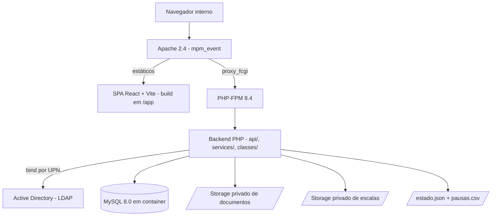

# Documentação Técnica — ChronoDesk / Portal SDK

**Versão:** 1.0 · **Data:** 2026-09-28 · **Branch de referência:** `codex/modernizacao-ui-backend`

> Documento sanitizado: não contém domínios internos, hostnames de AD, IPs, usuários nominais ou credenciais. Itens que dependem de definição do negócio estão marcados como **A DEFINIR**; itens sem evidência disponível estão marcados como **UNKNOWN / TO CONFIRM**.

---

## 1. Objetivo

Aplicação web interna de TI/SUPTEC para gestão operacional da equipe de Service Desk: controle de pausas, escalas presencial/remoto, mapa de postos de atendimento (PA), chamados críticos (War Room), horas extras, correção de ponto, plantões, documentos e relatórios.

Substitui controles anteriores em planilha e em arquivos locais, centralizando registro, aprovação e auditoria das operações da equipe.

**Público:** colaboradores do SDK (técnicos N1/N2), gestores e administradores do setor.

---

## 2. Descrição funcional

| Módulo | Função |
|---|---|
| **Pausas** | Início/fim de pausa por colaborador autenticado no AD. Pausa de reunião N1 exige aprovação de gestor; N2 é automática. Limite de pausas simultâneas por equipe configurável. Encerramento forçado por administrador, com auditoria. |
| **Dashboard** | Visão em tempo real de quem está em pausa, pendências de aprovação e resumo de chamados críticos. |
| **Métricas / Relatórios** | Consolidação de pausas por colaborador, equipe e motivo; exportação CSV/ZIP. |
| **Chamados críticos (War Room)** | Registro de incidentes com origem ServiceNow, Teams ou Outros; tempo de sala calculado; importação e exportação CSV. |
| **Escalas** | Regra de presença por colaborador: `even_days`, `odd_days`, `always_onsite`, `always_remote`, `fixed_weekdays`, `undefined`. Exceções por data. Importação por planilha. |
| **Mapa de PA** | Alocação de colaboradores a postos físicos, com unicidade garantida no banco. |
| **Horas extras** | Lançamento pelo colaborador, aprovação por gestor/admin, exportação CSV com totais. |
| **Correção de ponto** | Mesmo fluxo de aprovação das horas extras. |
| **Plantão / Sobreaviso** | Registro de escalas de plantão por período. |
| **Documentos** | Upload/download controlado, com validação de conteúdo e visibilidade por perfil. |
| **Escalas de sábado** | Publicação de anexos (PDF/imagem/planilha) por mês de referência. |
| **Avisos e notificações** | Comunicados e notificações por usuário/perfil. |
| **Administração** | Cadastro de colaboradores, perfis de acesso, configuração do sistema e usuários locais (quando habilitado). |

---

## 3. Arquitetura e fluxo

**Fluxo de autenticação:**

1. A SPA chama `GET /api/session.php` e obtém token CSRF, perfil e permissões.
2. O usuário informa login e senha do AD; a SPA envia para `POST /api/login_ci.php` (ou `login_admin.php`).
3. O backend faz `ldap_bind` direto com a credencial informada — **não há conta de serviço**. Senha vazia é rejeitada antes do bind.
   Antes do bind passam dois limites: por IP (arquivo temporário, como antes) e por usuário, independente de IP (tabela `login_user_throttle`, SEC-03): 5 tentativas sem sucesso, zeradas após 15 min sem tentativa ou no login concluído. Sem acesso à tabela, o login é recusado com 503. Ver `docs/LIMITE_LOGIN_POR_USUARIO.md`.
4. Com o bind aceito, busca-se o colaborador por `ad_login` na tabela `funcionarios`.
5. A sessão é regenerada (`session_regenerate_id(true)`) e o perfil é gravado na sessão PHP.
6. Toda requisição de escrita exige token CSRF válido no header `X-CSRF-Token`.

**Fluxo de deploy (atual):** `git pull --ff-only` na VM → `npm ci && npm run build` no frontend (saída em `../app`, não versionada) → QA → validação por `curl`. O diretório `/app` é gerado no servidor.

---

## 4. Tecnologias

| Camada | Tecnologia |
|---|---|
| Servidor web | Apache 2.4.58, `mpm_event`, `proxy_fcgi` |
| Runtime PHP | PHP 8.4.23 via PHP-FPM (socket unix); `mod_php` removido |
| Backend | PHP procedural + serviços em classes finais; PDO/MySQL com prepared statements |
| Banco | MySQL 8.0 em container Docker, exposto em `127.0.0.1:3306` |
| Autenticação | LDAP / Active Directory (bind por UPN) |
| Frontend | React 18 + Vite; TypeScript permissivo (`allowJs=true`, `checkJs=false`, `strict=false`) |
| Bibliotecas | TanStack Query, TanStack Table, React Hook Form, Zod, Tailwind CSS |
| QA | `scripts/qa-smoke.php` (PHP), `scripts/qa-auth.php` (PHP, testes negativos de LDAP; sem banco, exige extensão `ldap`) e `frontend/scripts/qa-*.mjs` (Node) |

---

## 5. Inventário de dados pessoais tratados (LGPD)

Levantado a partir do schema em `migrations/` e `database_SECURED.sql`.

### 5.1 Dados de identificação

| Dado | Onde | Origem | Finalidade |
|---|---|---|---|
| Nome completo | `funcionarios.nome`; `*.employee_name`; `pausas.nome_funcionario` | Cadastro manual / AD | Identificar o colaborador nas telas e relatórios |
| Login de rede (sAMAccountName) | `funcionarios.ad_login`, `ad_login_ativo`; `usuarios.username`; campos `created_by`, `updated_by`, `approved_by`, `reviewed_by`, `uploaded_by`, `author`, `recipient_username`, `related_username` | AD | Autenticação, autorização e rastreabilidade de ações |
| E-mail corporativo | Obtido do AD em tempo de login (atributo `mail`) | AD | Exibição; **não é persistido** em tabela própria |
| Equipe e perfil de acesso | `funcionarios.equipe`, `funcionarios.access_role` | Cadastro manual | Controle de acesso (RBAC) e regras de pausa |
| Endereço IP | `audit_log.user_ip` | Requisição HTTP | Auditoria de segurança |

### 5.2 Dados de jornada e comportamento

| Dado | Onde | Sensibilidade |
|---|---|---|
| Jornada e horário de almoço | `funcionarios.jornada_*`, `almoco_*` | Comum |
| Histórico de pausas (início, fim, duração, motivo) | `pausas`, `estado.json`, `pausas.csv` | Comum — permite inferir comportamento individual ao longo do dia |
| Observação de reunião | `pausas.observacao_reuniao`; `pause_approval_requests` | Comum — texto livre preenchido pelo colaborador |
| Horas extras (data, horários, motivo, justificativa) | `portal_overtime_entries` | Comum — dado trabalhista |
| Correção de ponto (horário registrado × correto, justificativa) | `portal_time_adjustments` | Comum — dado trabalhista |
| Escala presencial/remoto | `portal_schedule_rules`, `portal_schedule_exceptions` | Comum — revela presença física |
| Posto de trabalho físico | `portal_pa_assignments`, `portal_pa_map` | Comum — revela localização física |
| Plantão / sobreaviso | `portal_oncall_shifts` | Comum |
| Telefone | `portal_schedules.phone` | Comum — **A DEFINIR:** telefone pessoal ou corporativo? |

### 5.3 Dado potencialmente sensível — requer decisão

| Dado | Onde | Situação |
|---|---|---|
| Motivo de ausência | `portal_absences.reason`, `absence_type` | **A DEFINIR.** Se o campo receber motivo de afastamento médico, é dado pessoal sensível (art. 5º, II da LGPD) e exige base legal e controle de acesso específicos. Hoje a listagem está acessível a qualquer perfil autenticado (achado SEC-07 da auditoria). |

### 5.4 Retenção e eliminação

- **Política de retenção: A DEFINIR.** Não há expurgo automático em nenhuma tabela.
- `audit_log` cresce indefinidamente; sem política de retenção definida.
- `pausas.csv` e `estado.json` não têm rotação.
- **Backup:** rotina entregue no Lote 3 e pendente de instalação no servidor (seção 10). Os backups contêm os mesmos dados pessoais da base e ficam retidos por `RETENTION_DAYS` (padrão 14 dias) em `/var/backups/chronodesk`, com acesso restrito a root.

### 5.5 Compartilhamento com terceiros

Nenhum dado pessoal é enviado a serviço externo. `portal_sync_queue` e `SharePointSyncService` existem como fila preparada, mas **nenhuma integração externa está ativa** (ver seção 6).

---

## 6. Integrações

| Integração | Situação |
|---|---|
| **Active Directory (LDAP)** | **Ativa.** Bind direto com a credencial do usuário, porta 389 sem TLS. |
| **MySQL 8.0** | **Ativa.** Container Docker local. |
| ServiceNow | **Não integrado.** Registrado apenas como *origem* textual de chamado crítico. |
| Microsoft Teams | **Não integrado.** Idem. |
| SharePoint / M365 | **Preparado, inativo.** `SharePointSyncService` enfileira em `portal_sync_queue`; sem credenciais configuradas. |
| E-mail (SMTP) | **Desativado** (`MAIL_ENABLED=false`). |
| Senior, SailPoint, Grafana, Zabbix, Wazuh | **Apenas variáveis reservadas**, sem implementação. |

---

## 7. Regras de negócio

### 7.1 Pausas

| Tipo | Aprovação | Conta para limite simultâneo | Limite de tempo |
|---|---|---|---|
| Pessoal | Não | Não | Não |
| Café | Não | Sim | Sim (padrão 20 min, configurável) |
| Reunião — N1 | **Sim**, por gestor/admin | Não | Não |
| Reunião — N2 | Não (automática) | Não | Não |
| Almoço / jornada | — | — | Informativo apenas |

- Encerramento forçado por administrador gera evento de auditoria `BREAK_FORCE_ENDED_BY_ADMIN`.
- Pausas abandonadas (> 24h) são reiniciadas automaticamente.
- Todo o ciclo de leitura-alteração-escrita do estado é serializado por lock exclusivo de arquivo.

### 7.2 Escalas

| Regra | Comportamento |
|---|---|
| `even_days` | Presencial em dias pares do calendário |
| `odd_days` | Presencial em dias ímpares do calendário |
| `always_onsite` / `always_remote` | Fixo |
| `fixed_weekdays` | Presencial nos dias da semana configurados (seg–sex) |
| `undefined` | Sem escala definida (tratado como remoto) |

- Remoção de escala grava `rule_type='undefined'`, `rule_config=NULL` e `effective_until` no dia anterior.
- **Limitação conhecida:** a restrição `UNIQUE(employee_id)` permite uma única regra por colaborador — **não há histórico de escala**. Relatórios de datas passadas usam a regra vigente. Ver achado BIZ-03.
- **Limitação conhecida:** a paridade é calculada sobre o dia do calendário; na virada de meses com 31 dias, o mesmo grupo fica presencial dois dias seguidos. Ver achado BIZ-05.
- Jornada visual: 08:00–18:00; almoço de 1h20.

### 7.3 Horas extras e correção de ponto

- Lançamento por técnico apenas para si; gestor/admin podem lançar para terceiros.
- Aprovação exige perfil gestor, Liderança ou admin; **autoaprovação é bloqueada** no servidor. Hora extra pendente com entrada igual à saída (24 h) não pode ser aprovada, só rejeitada.
- Decisão protegida por transação e `SELECT ... FOR UPDATE`; só registros `pending` podem ser decididos.
- Duração calculada com virada de dia (fim < início ⇒ dia seguinte). Início igual ao fim é recusado. Sem teto por lançamento (decisão do negócio, 2026-09-30).
- Totais por colaborador em duas colunas, aprovado e pendente; rejeitados não entram em nenhum total. Ver `docs/HORAS_EXTRAS_LOTE6.md`.
- Competência quinzenal: dia 16 do mês anterior ao dia 15 do mês corrente.

### 7.4 Mapa de PA

- Postos identificados por número; unicidade garantida no banco tanto por posto quanto por colaborador em alocação ativa.
- Equipes: `n1`, `n2`, `lideranca`.

---

## 8. Perfis de acesso

| Perfil | Permissões |
|---|---|
| `tecnico` | `portal.read`, `pausas.use` — vê e lança apenas os próprios registros operacionais |
| `somente_leitura` | `portal.read` — nenhuma operação de escrita |
| `gestor` | leitura do portal, pausas, métricas, relatórios, documentação, avisos, **aprovação de operações** e `ausencias.manage` |
| `lideranca` | tudo do gestor mais `funcionarios.manage`, `escalas.manage`, `pa_map.manage`, `pausas.force_end` (Lote 5: no 5b, funcionários está ativo, sem promover à Liderança nem alterar cadastros de Liderança ou admin; escalas, Mapa PA e forçar fim de pausa chegam no 5c) |
| `admin` | tudo da Liderança mais `admin.manage`, `configuracoes.manage`, `integracoes.manage`, `usuarios_locais.manage`, `perfis.promote` |

**Concessão do perfil administrativo (Lote 5a, 2026-10-02):** admin vem **só** da allowlist `AD_ADMIN_USERS`, comparada pela mesma normalização do bind, em todos os logins. `funcionarios.access_role = 'admin'` é valor legado e não concede administração: vira `lideranca` na equipe Liderança e `gestor` fora dela. A equipe não concede permissão. Exceção explícita: o admin local de emergência (`ENABLE_LOCAL_ADMIN`, procedimento em `DEPLOY_LINUX.md`). O perfil é recalculado a cada requisição a partir do cadastro e da allowlist; se cair, a sessão é encerrada (`SESSION_REVOKED`). Desenho completo: `docs/DESENHO_PERFIL_LIDERANCA.md`.

---

## 9. Limitações conhecidas

1. **Sem criptografia em trânsito.** Portal em HTTP; LDAP na porta 389 sem TLS; cookie de sessão sem flag `Secure`.
2. **Backup e teste de restauração entregues, ainda não instalados** no servidor. Quando instalado, o backup fica no mesmo disco da VM: não protege contra perda da VM.
3. **Endpoint de saúde entregue (`api/health.php`), sem monitoramento configurado** para consumi-lo.
4. **Sem histórico de escala** (seção 7.2).
5. **Cadastro limitado a 999 colaboradores** por validação de entrada.
6. **Listas de tela limitadas a 100–500 registros**, com aviso quando há mais (Lote 6). As exportações CSV não truncam.
7. **Estado de pausas em arquivo** (`estado.json`), não no banco — sem garantia transacional, serializado por lock global.
8. **Interface legada em PHP** ainda presente no servidor; acessível por POST.
9. **Fuso horário não alinhado** entre PHP e a sessão MySQL (sessão em UTC, confirmado no servidor em 2026-09-30). Correção entregue no lote de fuso, **pendente de deploy**: a conexão passa a definir `America/Sao_Paulo`. Os `DATETIME` gravados pelo relógio do MySQL antes do deploy (auditoria, aprovações, decisões, remoções) continuam 3 h adiante até a correção histórica, feita por script separado. Ver `docs/FUSO_HORARIO_BIZ02.md`.
10. **Repositório fora da esteira corporativa** (conta pessoal); migração para Azure DevOps pendente.

---

## 10. Suporte e contingência

| Item | Situação |
|---|---|
| Responsável técnico | Matheus Camargo |
| Dono do produto / área responsável | **A DEFINIR** |
| Canal de suporte | **A DEFINIR** |
| Horário de atendimento / SLA | **A DEFINIR** |
| Backup do banco | `scripts/backup-chronodesk.sh` (diário via `deploy/systemd/chronodesk-backup.timer`, retenção de 14 dias). **Entregue no Lote 3; pendente de instalação no servidor.** Procedimento em `DEPLOY_LINUX.md`, seção "Backup". |
| Backup dos arquivos privados (documentos e escalas) | Mesmo script (`files.tar.gz`). Mesma situação. |
| Cópia externa do backup | **A DEFINIR** — hoje o backup fica no disco da própria VM. |
| Teste de restauração | Procedimento documentado em `DEPLOY_LINUX.md` (banco de teste separado). **Nunca executado.** |
| Rollback de deploy | Código: `git checkout` do commit anterior (`DEPLOY_LINUX.md`, "Atualização de Versão e Rollback"). Banco: somente por restauração do backup pré-deploy — migrations sem scripts de reversão. |
| Monitoramento | `api/health.php` (200/503, restrito por `HEALTH_ALLOWED_IPS`). **Nenhum sistema de monitoração configurado para consumi-lo.** |
| Jobs agendados | **UNKNOWN / TO CONFIRM** — inventário de cron/systemd não levantado |
| Plano de continuidade | **A DEFINIR** |

### Procedimento de diagnóstico para erro 5xx

Ordem recomendada, validada em incidente real (falha de socket PHP-FPM):

1. `systemctl status apache2 --no-pager` e `apache2ctl configtest`
2. `systemctl status php8.4-fpm --no-pager` e `ls -l /run/php/`
3. Conferir o socket real: `grep -R "listen =" /etc/php/8.4/fpm/pool.d/`
4. Conferir o handler do Apache: `grep -R "SetHandler\|fpm.sock" /etc/apache2/`
5. `curl -i http://localhost/api/session.php`
6. Logs do Apache e do PHP
7. Só então investigar código de aplicação

---

## 11. Histórico de revisões

| Versão | Data | Autor | Mudança |
|---|---|---|---|
| 1.0 | 2026-09-28 | Matheus Camargo (elaboração assistida por IA — ver `REGISTRO_USO_IA.md`) | Versão inicial, gerada no Lote 1 do plano de remediação |
| 1.1 | 2026-10-02 | Matheus Camargo (elaboração assistida por IA) | Perfis do Lote 5a (Liderança, admin só pela allowlist, revalidação por requisição) e recusa da aprovação de 24 h |
